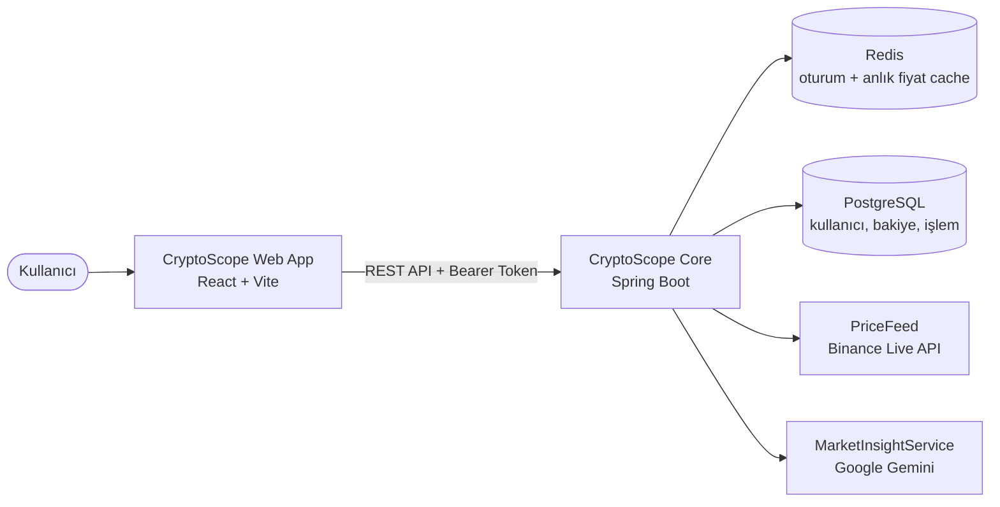
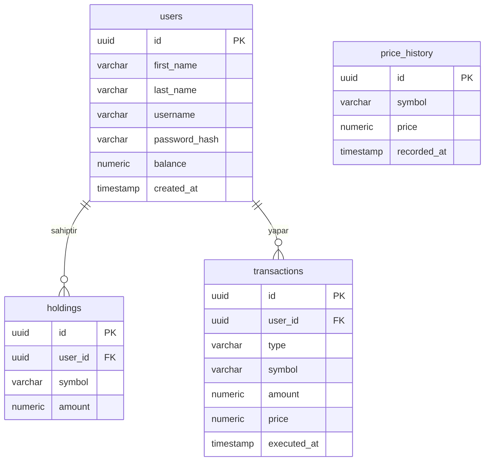

# CryptoScope

<p>
  
  
  
  
  
  
  
</p>

**CryptoScope**, kripto para alım-satımını simüle eden ve yapay zeka destekli piyasa analizi sunan bir sanal yatırım platformudur. i2i Academy'nin CryptoPal ödevi kapsamında geliştirilmiştir.

---

## İçindekiler

- [Özellikler](#özellikler)
- [Mimari](#mimari)
- [Desteklenen Kripto Paralar](#desteklenen-kripto-paralar)
- [Veritabanı Şeması](#veritabanı-şeması)
- [API Endpoint'leri](#api-endpointleri)
- [Kurulum](#kurulum)
- [Ortam Değişkenleri](#ortam-değişkenleri)
- [Ekip](#ekip)

---

## Özellikler

| | |
|---|---|
| 🔐 | Kullanıcı kaydı ve girişi (Bearer token tabanlı, stateless oturum) |
| 📈 | Binance Live API üzerinden 10 kripto paranın gerçek zamanlı fiyatı |
| ⚡ | Redis ile 15 saniyede bir yenilenen, düşük gecikmeli fiyat önbelleği |
| 💰 | Sanal bakiye ile al-sat (buy/sell) işlemleri ve otomatik bakiye güncellemesi |
| 📊 | Portföy görünümü: nakit bakiye, varlıklar, güncel değer |
| 🧾 | Geçmiş işlemlerin (transaction history) listelenmesi |
| 🤖 | Google Gemini destekli, kullanıcının portföyünü baz alan AI sohbet asistanı |
| 📄 | Swagger / OpenAPI ile canlı API dokümantasyonu |
| 🐳 | Docker Compose ile tek komutla PostgreSQL + Redis ortamı |

## Mimari



| Klasör | Açıklama |
|---|---|
| `web-app/` | Frontend (React + Vite SPA) |
| `core/` | CryptoScope Core — tek Spring Boot uygulaması (auth, piyasa verisi, trading, portföy, AI entegrasyonu) |
| `db/init/` | Container ilk ayağa kalkışında otomatik çalışan DDL script'leri |
| `docker-compose.yml` | Yerel PostgreSQL ve Redis ortamı |

## Desteklenen Kripto Paralar

| Sembol | İsim | Sembol | İsim |
|---|---|---|---|
| BTC | Bitcoin | ADA | Cardano |
| ETH | Ethereum | DOGE | Dogecoin |
| BNB | BNB | AVAX | Avalanche |
| SOL | Solana | DOT | Polkadot |
| XRP | XRP | LINK | Chainlink |

Fiyatlar Binance'in genel (auth gerektirmeyen) REST API'sinden çekilir ve Redis'te 15 saniyelik aralıklarla tazelenir.

## Veritabanı Şeması



## API Endpoint'leri

| Method | Endpoint | Açıklama | Yetkilendirme |
|---|---|---|---|
| POST | `/api/auth/register` | Yeni kullanıcı kaydı | Gerekmez |
| POST | `/api/auth/login` | Giriş, Bearer token döner | Gerekmez |
| GET | `/api/market/prices` | Güncel fiyatlar (Redis) | Gerekmez |
| POST | `/api/trades/buy` | Kripto satın alma | Bearer Token |
| POST | `/api/trades/sell` | Kripto satma | Bearer Token |
| GET | `/api/portfolio` | Bakiye ve varlıklar | Bearer Token |
| GET | `/api/transactions` | İşlem geçmişi | Bearer Token |
| POST | `/api/ai/chat` | Gemini AI ile sohbet | Bearer Token |

Tüm endpoint'leri interaktif olarak test etmek için: `http://localhost:8080/swagger-ui/index.html`

## Kurulum

> **Not:** Backend ve frontend ayrı süreçlerdir, **iki ayrı terminal** açık tutmanız gerekir. Docker ve backend'i kapatmadan frontend'i başlatın.

1. `docker compose up -d` ile PostgreSQL ve Redis'i ayağa kaldırın
2. Gemini API key'ini terminalde ortam değişkeni olarak tanımlayın (bu adım `.env` dosyası değil, gerçek shell komutudur):
```bash
   export GEMINI_API_KEY=<key_degeriniz>
```
3. **Terminal 1** — Backend'i çalıştırın ve bu terminali açık bırakın:
```bash
   cd core
   ./mvnw spring-boot:run
```
   "Started CoreApplication" satırını gördüğünüzde backend hazırdır (port 8080).
4. **Terminal 2** (yeni bir pencere/sekme) — Frontend'i çalıştırın:
```bash
   cd web-app
   npm install
   npm run dev
```
   Terminalde verilen adresi (genelde `http://localhost:5173`) tarayıcıda açın.
5. API dokümantasyonu: `http://localhost:8080/swagger-ui/index.html`

> Veritabanı şeması (`db/init/001_schema.sql`) yalnızca **boş** bir Postgres volume'ünde ilk kurulumda çalışır. Şema değişikliği sonrası temiz bir kurulum için: `docker compose down -v && docker compose up -d`

## Ortam Değişkenleri

PostgreSQL ve Redis için ekstra bir ayar gerekmez — kullanıcı adı/şifre `docker-compose.yml` içinde tanımlıdır.

Backend'i çalıştırmadan önce şu değişkeni terminalde tanımlamanız yeterlidir (bkz. Kurulum adım 2):

```
GEMINI_API_KEY=<Gemini API anahtarınız>
```

Bu değeri git'e commit etmeyin, sadece kendi terminalinizde `export` ile tanımlayın.

## Ekip

| Alan | Sorumlu |
|---|---|
| Frontend (Web App) | Esra |
| Core (Auth, Piyasa Verisi, Trading) | Tarık |
| External Data Provider, AI, Altyapı | Kutay |
