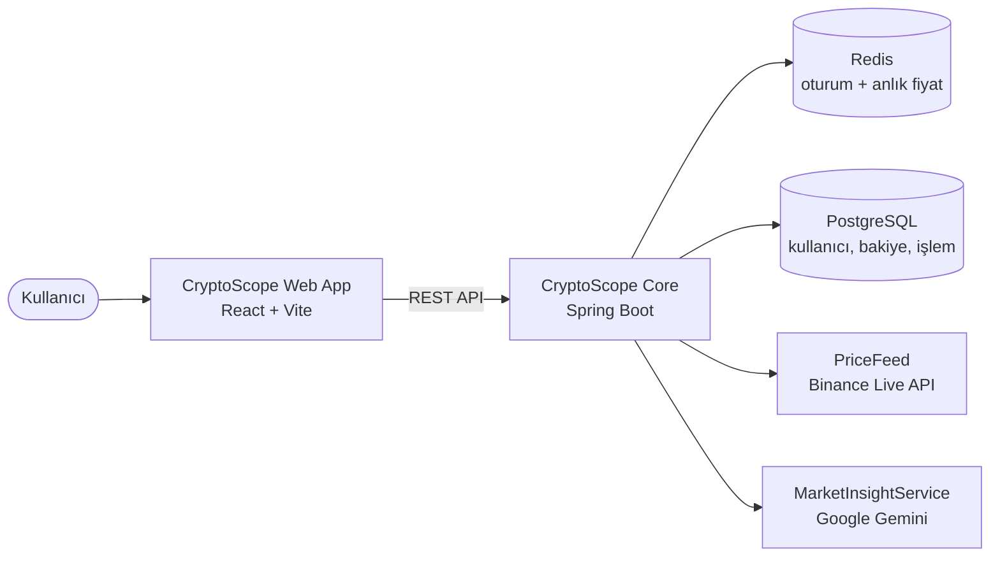
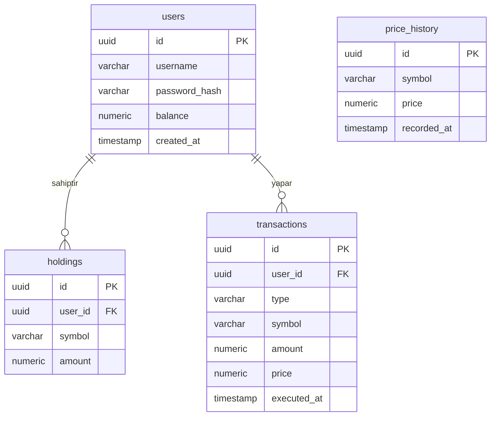

# CryptoScope

CryptoScope, kripto para alım-satımını simüle eden ve yapay zeka destekli piyasa analizi sunan bir platformdur. i2i Academy'nin CryptoPal ödevi kapsamında geliştirilmektedir.

## Mimari



- **web-app/** — Frontend (React + Vite SPA)
- **core/** — CryptoScope Core (tek Spring Boot uygulaması: auth, piyasa verisi, trading, AI entegrasyonu)
- **docker-compose.yml** — Yerel PostgreSQL ve Redis ortamı

## Veritabanı Şeması



## Kurulum

> **Not:** Backend ve frontend ayrı süreçlerdir, **iki ayrı terminal** açık tutmanız gerekir. Docker ve backend'i kapatmadan frontend'i başlatın.

1. `docker compose up -d` ile PostgreSQL ve Redis'i ayağa kaldırın
2. Gemini API key'ini terminalde ortam değişkeni olarak tanımlayın (bu adım `.env` dosyası değil, gerçek shell komutudur):
```bash
   export GEMINI_API_KEY=<key_degeriniz>
```
3. **Terminal 1** — Backend'i çalıştırın ve bu terminali açık bırakın:
```bash
   cd core
   ./mvnw spring-boot:run
```
   "Started CoreApplication" satırını gördüğünüzde backend hazırdır (port 8080).
4. **Terminal 2** (yeni bir pencere/sekme) — Frontend'i çalıştırın:
```bash
   cd web-app
   npm install
   npm run dev
```
   Terminalde verilen adresi (genelde `http://localhost:5173`) tarayıcıda açın.
5. API dokümantasyonu: `http://localhost:8080/swagger-ui/index.html`

## Ortam Değişkenleri

PostgreSQL ve Redis için ekstra bir ayar gerekmez — kullanıcı adı/şifre `docker-compose.yml` içinde tanımlıdır.

Backend'i çalıştırmadan önce şu değişkeni terminalde tanımlamanız yeterlidir (bkz. Kurulum adım 2):

```
GEMINI_API_KEY=<Gemini API anahtarınız>
```

Bu değeri git'e commit etmeyin, sadece kendi terminalinizde `export` ile tanımlayın.

## Ekip

| Alan | Sorumlu |
|---|---|
| Frontend (Web App) | Esra |
| Core (Auth, Piyasa Verisi, Trading) | Tarık |
| External Data Provider, AI, Altyapı | Kutay |