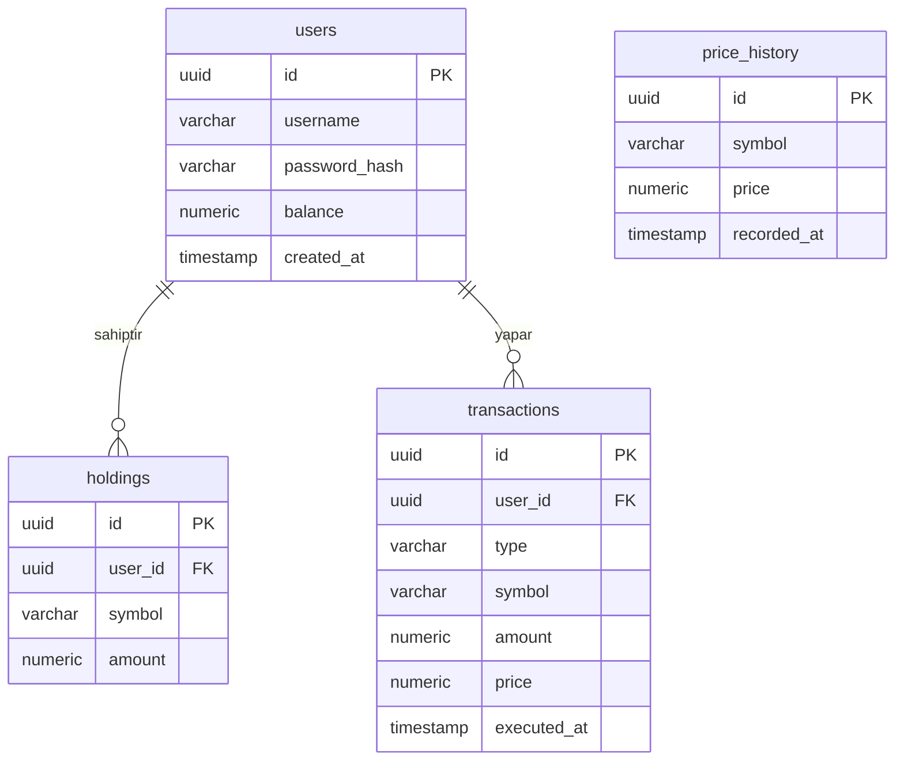

# CryptoScope

CryptoScope, kripto para alım-satımını simüle eden ve yapay zeka destekli piyasa analizi sunan bir platformdur. i2i Academy'nin CryptoPal ödevi kapsamında geliştirilmektedir.

## Mimari


- **web-app/** — Frontend (React + Vite SPA)
- **core/** — CryptoScope Core (tek Spring Boot uygulaması: auth, piyasa verisi, trading, AI entegrasyonu)
- **docker-compose.yml** — Yerel PostgreSQL ve Redis ortamı

## Veritabanı Şeması



## Kurulum

1. `.env` dosyasını oluşturun (aşağıdaki değişkenleri doldurun)
2. `docker compose up -d` ile PostgreSQL ve Redis'i ayağa kaldırın
3. Backend'i çalıştırın:
```bash
   cd core
   ./mvnw spring-boot:run
```
4. Frontend'i çalıştırın:
```bash
   cd web-app
   npm install
   npm run dev
```
5. API dokümantasyonu: `http://localhost:8080/swagger-ui/index.html`

## Ortam Değişkenleri (.env)

```
POSTGRES_DB=cryptopal
POSTGRES_USER=cryptopal
POSTGRES_PASSWORD=cryptopal
REDIS_HOST=localhost
REDIS_PORT=6379
GEMINI_API_KEY=
```

## Ekip

| Alan | Sorumlu |
|---|---|
| Frontend (Web App) | Esra |
| Core (Auth, Piyasa Verisi, Trading) | Tarık |
| External Data Provider, AI, Altyapı | Kutay |